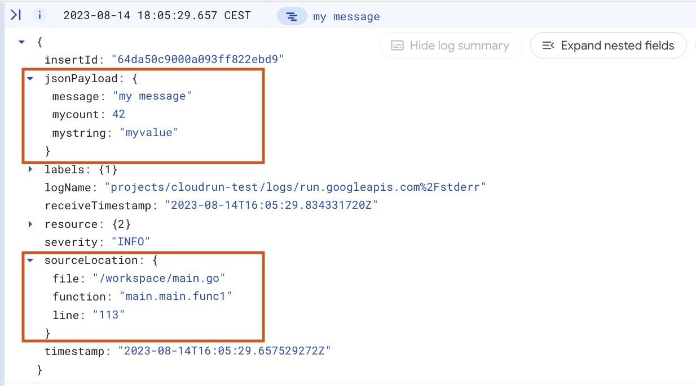
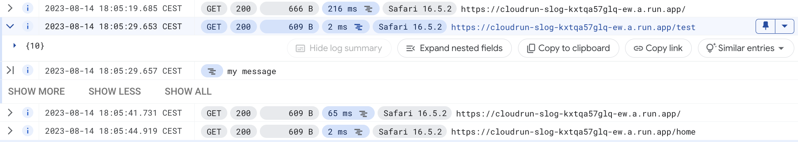

# Example Cloud Run Go app with lightweight structured logging using `slog`

This is a small example of a Go web app for [Cloud Run](https://cloud.google.com/run) that uses
Go 1.21's standard library [`slog`](https://pkg.go.dev/log/slog) package for structured logging to Cloud Logging.

Contrary to the [documented 'standard' approach for
logging](https://cloud.google.com/logging/docs/setup/go), this doesn't
use any third-party logging package for logging. Instead, it relies on
Cloud Run's support for ingesting structured logs by [simply printing
JSON to standard
error](https://cloud.google.com/run/docs/logging#using-json).

## Outputting structured JSON for Cloud Logging

Most of the heavy lifting of logging can be done with the standard [`JSONHandler`](https://pkg.go.dev/golang.org/x/exp/slog#JSONHandler).
Cloud Logging uses [different naming for some attributes](https://cloud.google.com/logging/docs/agent/logging/configuration#special-fields), so these need to be renamed (which can be done using `HandlerOptions`).

Cloud Logging also supports a `CRITICAL` log level that isn’t part of the standard library, and support for this can be added in the
same place:

```go
h := slog.NewJSONHandler(os.Stderr, &slog.HandlerOptions{
  AddSource: true,
  Level:     slog.LevelDebug,
  ReplaceAttr: func(groups []string, a slog.Attr) slog.Attr {
    if a.Key == slog.MessageKey {
      a.Key = "message"
    } else if a.Key == slog.SourceKey {
      a.Key = "logging.googleapis.com/sourceLocation"
    } else if a.Key == slog.LevelKey {
      a.Key = "severity"
      level := a.Value.Any().(slog.Level)
      if level == LevelCritical {
        a.Value = slog.StringValue("CRITICAL")
      }
    }
    return a
  })
})

const LevelCritical = slog.Level(12)
```

Using the resulting handler on the default logger ensures that all log messages are output in JSON that is automatically ingested by Cloud Logging, including file/line support and extra structured properties.

```go
slog.SetDefault(slog.New(h))

…

slog.Info("my message", 
  "mycount", 42, 
  "mystring", "myvalue"
)
```

Accessing this handler gives the following result in the Cloud Logging Console:



## Correlating structured logs with the request log

Using the above handler, all log messages appear in the Cloud Run logs, but they are not correlated with the request log of Cloud Run. To add a parent-child relationship between the log messages and the Cloud Run request log, the trace needs to be captured from the request headers, and added as an extra field in the JSON output. 

Capturing the trace can be done by adding a piece of middleware that extracts the trace ID from the request header, and adds it to the request context:

```go
func WithCloudTraceContext(h http.Handler) http.Handler {
  projectID, err := metadata.ProjectID()
  if err != nil {
    panic(err)
  }
  return http.HandlerFunc(func(w http.ResponseWriter, r *http.Request) {
    var trace string
    traceHeader := r.Header.Get("X-Cloud-Trace-Context")
    traceParts := strings.Split(traceHeader, "/")
    if len(traceParts) > 0 && len(traceParts[0]) > 0 {
      trace = fmt.Sprintf("projects/%s/traces/%s", projectID, traceParts[0])
    }
    h.ServeHTTP(w, r.WithContext(context.WithValue(r.Context(), "trace", trace)))
  })
}

mux := http.NewServeMux()
…
http.ListenAndServe(":"+port, WithCloudTraceContext(mux))
```

The trace ID can then be added to the output by defining a custom handler that extracts the trace from the context, and adds the extra attribute before passing it on to the standard JSON handler:

```go
func NewCloudLoggingHandler() *CloudLoggingHandler {
  return &CloudLoggingHandler{handler: slog.NewJSONHandler(…)}
}

func (h *CloudLoggingHandler) Handle(ctx context.Context, rec slog.Record) error {
  trace := ctx.Value("trace")
  if trace != nil && trace.(string) != "" {
    rec = rec.Clone()
    rec.Add("logging.googleapis.com/trace", slog.StringValue(trace.(string)))
  }
  return h.handler.Handle(ctx, rec)
}
```

All logs belonging to a specific request can now be inspected by opening the dropdown
of the request of interest:




## Full example

The full working example above can be seen [here](https://github.com/remko/cloudrun-slog/blob/main/main.go). 

(Note that App Engine supports the same structured JSON output approach, so the same code can be used there)

